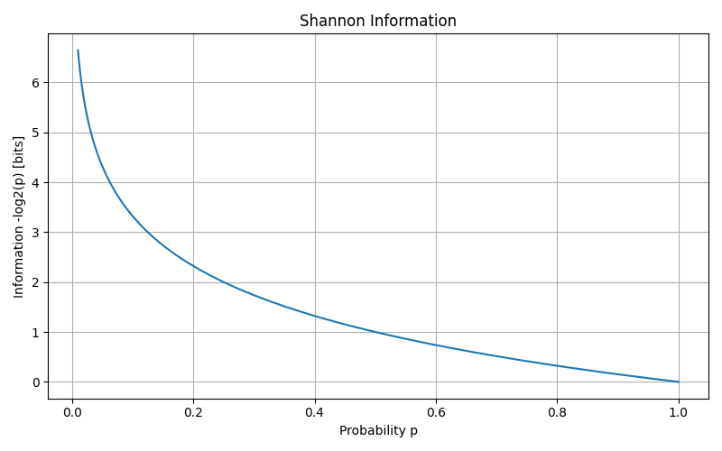
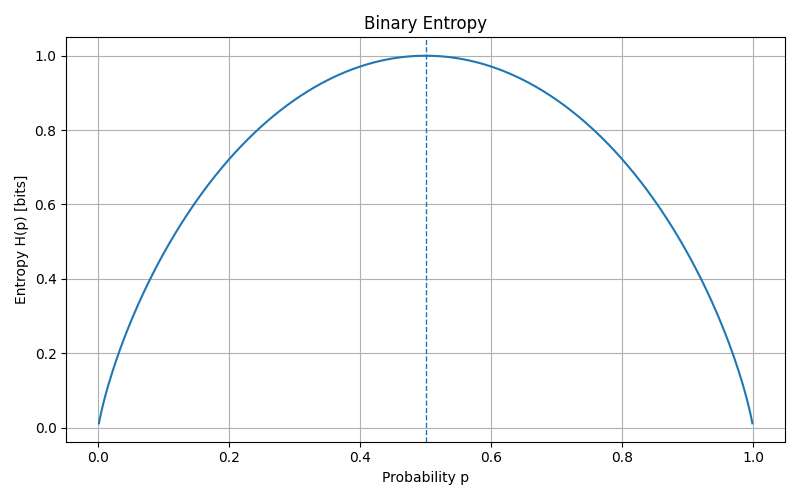
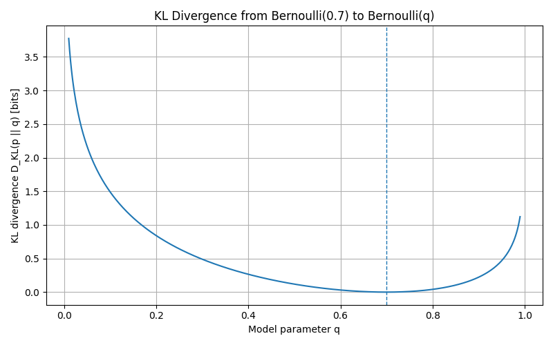
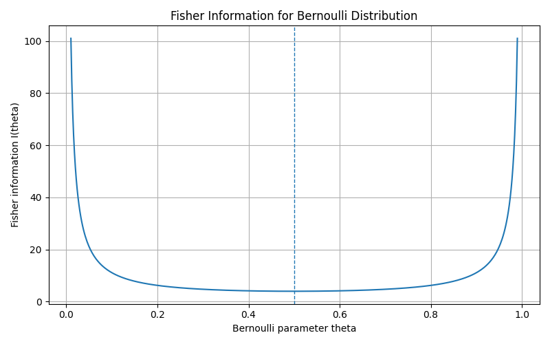
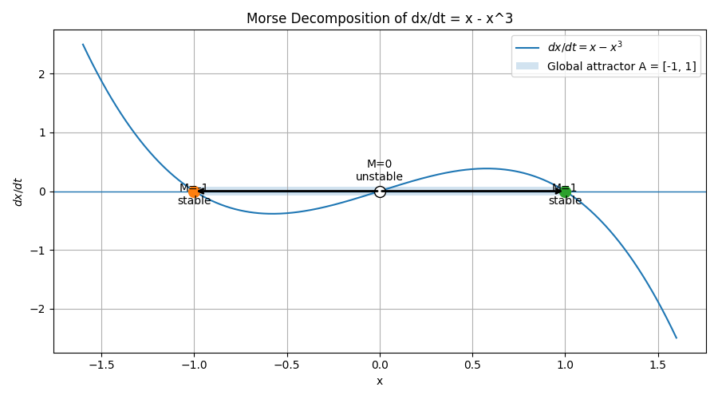

# 区別可能性としての情報

## 1. 概要

本課題では、情報を 「可能性を区別する力」と定義する。

講義では、情報は単なるデータや意味ではなく、不確実性を減らしたり、複数の可能性を区別したりする量として扱われていた。
そこで本課題では、情報を次のように考える。

> 情報とは、事象、確率分布、パラメータ、または未来の状態を区別するための量または構造である。

この考え方を示すために、Pythonを用いて以下の5つの例を可視化した。

1. Shannon情報
2. 二値エントロピー
3. KLダイバージェンス
4. Fisher情報
5. Morse分解

Shannon情報では、情報は事象の起こりにくさを表す。
二値エントロピーでは、情報は平均的な不確実性として表される。
KLダイバージェンスでは、情報は2つの確率分布の違いとして表される。
Fisher情報では、情報は近いパラメータの区別しやすさとして表される。
Morse分解では、情報は力学系における可能な未来の構造として表される。

これらを通して、情報は「可能性を区別するための数学的な量または構造」であることを示す。

## 2. 氏名

松本健太郎

## 3. 実行手順

以下の手順に従うことで、本READMEに示した結果と同じ図を得ることができる。

### 3.1 Conda環境を作成する

Pythonを実行するための仮想環境を作成し、有効化する。

```bash
conda create -n info_project python=3.11
conda activate info_project
```

### 3.2 必要なライブラリをインストールする

本プログラムでは、数値計算に `numpy`、グラフ作成に `matplotlib` を使用する。
以下のコマンドで必要なライブラリをインストールする。

```bash
conda install numpy matplotlib
```

### 3.3 Pythonコードを実行する

以下のコマンドでプログラムを実行する。

```bash
python main.py
```

### 3.4 出力結果を確認する

実行後、`figures` フォルダ内に以下の画像ファイルが生成される。

```bash
figures/shannon_information.png
figures/binary_entropy.png
figures/kl_divergence.png
figures/fisher_information.png
figures/morse_decomposition.png
```

これらの画像が、本READMEの「結果を示す図」および「考察と分析」で説明する図に対応している。
したがって、上記の手順を実行することで、READMEに示した結果と同じ結果を再現できる。

## 4. 行ったこと

本課題では、情報を **「可能性を区別する力」** として定義し、その考え方をPythonによる可視化で示した。

### 4.1 Shannon情報

まず、確率 (p) で起こる事象の情報量を

[
I(p)=-\log_2 p
]

として計算した。

この式は、確率の低い事象ほど情報量が大きくなることを表している。
Pythonでは、確率 (p) を 0.01 から 1.0 まで変化させ、それぞれの情報量を計算してグラフ化した。

この処理により、まれな事象ほど多くの可能性を排除するため、大きな情報を持つことを確認した。

### 4.2 二値エントロピー

次に、2つの結果を持つ場合の平均的な不確実性として、二値エントロピーを計算した。

[
H(p)=-p\log_2 p-(1-p)\log_2(1-p)
]

Pythonでは、確率 (p) を 0 から 1 の間で変化させ、エントロピーの値をグラフ化した。

この処理により、結果が確定している (p=0) または (p=1) ではエントロピーが0になり、2つの結果が同じ確率で起こる (p=0.5) でエントロピーが最大になることを確認した。

### 4.3 KLダイバージェンス

次に、2つの確率分布の違いを表す量として、KLダイバージェンスを扱った。

真の分布を

[
p=Bernoulli(0.7)
]

とし、モデル分布を

[
q=Bernoulli(\theta)
]

とした。

このとき、KLダイバージェンス

[
D_{KL}(p|q)
]

を (\theta) の値を変えながら計算した。

この処理により、モデル分布が真の分布と一致する (\theta=0.7) でKLダイバージェンスが最小になり、そこから離れるほど値が大きくなることを確認した。
つまり、KLダイバージェンスは、2つの確率分布がどれだけ区別しやすいかを表す量として理解できる。

### 4.4 Fisher情報

さらに、パラメータの小さな変化に対する分布の敏感さを表す量として、Fisher情報を扱った。

Bernoulli分布のFisher情報は、

[
I(\theta)=\frac{1}{\theta(1-\theta)}
]

で表される。

Pythonでは、(\theta) を 0.01 から 0.99 まで変化させ、Fisher情報の値を計算してグラフ化した。

この処理により、(\theta) が 0 または 1 に近いときFisher情報が大きくなり、(\theta=0.5) 付近で小さくなることを確認した。
これは、Fisher情報が近いパラメータ値をどれだけ区別しやすいかを表していることを示している。

### 4.5 Morse分解

最後に、力学系における情報の例として、1次元微分方程式

[
\frac{dx}{dt}=x-x^3
]

を扱った。

この系には、

[
x=-1,\quad x=0,\quad x=1
]

の3つの平衡点がある。

そのうち、(x=-1) と (x=1) は安定平衡点であり、(x=0) は不安定平衡点である。
この構造をMorse分解として表すと、

[
M_-={-1},\quad M_0={0},\quad M_+={1}
]

となる。

また、不安定なMorse集合 (M_0) からは、

[
M_0 \rightarrow M_-
]

[
M_0 \rightarrow M_+
]

という2つの可能な未来方向がある。

Pythonでは、この微分方程式のベクトル場を描き、安定点、不安定点、大域アトラクタ、Morse集合間の接続を図として示した。

この処理により、情報は確率分布だけでなく、現在状態がどの未来へ向かう可能性を持つかを区別する構造としても表せることを示した。

## 5. 結果を示す図

### 5.1 Shannon情報



この図は、Shannon情報

[
I(p)=-\log_2 p
]

を表している。

横軸は確率 (p)、縦軸は情報量であり、単位は bit である。

確率が小さいとき、情報量は大きくなる。
これは、まれな事象が起こると、多くの可能性が排除されるためである。
一方で、(p) が 1 に近い場合、その事象はほぼ確実に起こるため、情報量は 0 に近づく。

この図は、情報が不確実性を減らすという基本的な考え方を示している。
予想しにくい事象ほど、多くの情報を与える。

---

### 5.2 二値エントロピー



この図は、二値エントロピー

[
H(p)=-p\log_2 p-(1-p)\log_2(1-p)
]

を表している。

エントロピーは、(p=0) または (p=1) のとき 0 になる。
この場合、結果はすでに確定しており、不確実性が存在しない。

一方で、エントロピーは

[
p=0.5
]

のとき最大になる。

これは、2つの結果が同じ確率で起こるとき、不確実性が最大になることを意味する。
したがって、二値エントロピーは、どちらの結果が起こるかを特定するために必要な平均情報量を表している。

この結果は、情報が可能な選択肢の間の不確実性と関係していることを示している。

---

### 5.3 KLダイバージェンス



この図は、2つのBernoulli分布の間のKLダイバージェンスを表している。

真の分布を

[
p = Bernoulli(0.7)
]

に固定し、モデル分布を

[
q = Bernoulli(\theta)
]

とする。

このとき、KLダイバージェンスは

[
D_{KL}(p|q)
]

である。

グラフは

[
\theta = 0.7
]

のとき最小になる。

これは、この点でモデル分布が真の分布と一致するためである。
(\theta) が 0.7 から離れるほど、KLダイバージェンスは大きくなる。
つまり、モデル分布は真の分布と区別しやすくなる。

したがって、KLダイバージェンスは、確率分布を区別するための情報として解釈できる。
また、誤った分布を用いたときに生じる余分な驚きの大きさを表している。

---

### 5.4 Fisher情報



この図は、Bernoulli分布のFisher情報

[
I(\theta)=\frac{1}{\theta(1-\theta)}
]

を表している。

Fisher情報は、パラメータを少し変化させたときに、確率分布がどれだけ敏感に変化するかを表す。

グラフを見ると、(\theta) が 0 または 1 に近いとき、Fisher情報は大きくなる。
これは、境界付近では (\theta) の小さな変化が分布に比較的大きな変化を与えることを意味する。
そのため、近いパラメータ同士を区別しやすい。

一方で、Fisher情報は

[
\theta=0.5
]

付近で最小になる。

この付近では、パラメータの小さな違いを区別することが比較的難しい。

この図は、情報が単に事象を区別するだけでなく、近いパラメータ値を区別する力としても考えられることを示している。

---

### 5.5 Morse分解



この図は、1次元力学系

[
\frac{dx}{dt}=x-x^3
]

を表している。

この系の平衡点は

[
x=-1,\quad x=0,\quad x=1
]

である。

(x=-1) と (x=1) は安定平衡点である。
一方、(x=0) は不安定平衡点である。

この大域アトラクタのMorse分解は、次のように表せる。

[
M_-={-1},\quad M_0={0},\quad M_+={1}
]

不安定なMorse集合 (M_0) からは、2つの可能な未来方向がある。

[
M_0 \rightarrow M_-
]

[
M_0 \rightarrow M_+
]

これは、不安定点の近くにある現在状態が、異なる安定状態へ向かう可能性を持つことを意味する。

この例では、情報の考え方を確率分布から力学系へ拡張している。
ここでの情報は、可能な未来の振る舞いを区別する構造として表されている。

## 6. 考察と分析

本課題では、情報を **「可能性を区別する力」** として定義し、Shannon情報、二値エントロピー、KLダイバージェンス、Fisher情報、Morse分解の5つの例を用いて確認した。

### 6.1 Shannon情報について

Shannon情報の図では、確率 (p) が小さいほど情報量

[
I(p)=-\log_2 p
]

が大きくなることが確認できた。

これは、まれな事象が起こったときほど、多くの可能性が排除されるためである。
例えば、ほぼ確実に起こる事象を知っても新しく得られる情報は少ない。
一方で、ほとんど起こらない事象が実際に起こったと分かれば、それまで考えられていた多くの可能性が否定される。

したがって、Shannon情報は「起こった事象がどれだけ意外か」を表す量であり、情報を不確実性の減少として捉える基本的な例である。

### 6.2 二値エントロピーについて

二値エントロピーの図では、(p=0) または (p=1) のときエントロピーが0になり、(p=0.5) のとき最大になることが確認できた。

これは、結果が確定している場合には不確実性がなく、情報を得る必要がないことを意味する。
逆に、2つの結果が同じ確率で起こる場合、どちらが起こるか最も予測しにくいため、不確実性が最大になる。

このことから、エントロピーは1回の事象の情報量ではなく、確率分布全体が持つ平均的な不確実性を表しているといえる。

### 6.3 KLダイバージェンスについて

KLダイバージェンスの図では、真の分布を (Bernoulli(0.7)) とし、モデル分布を (Bernoulli(\theta)) として比較した。

結果として、(\theta=0.7) のときKLダイバージェンスは最小になり、(\theta) が0.7から離れるほど値が大きくなった。

これは、モデル分布が真の分布と一致しているときには余分な情報や驚きが発生せず、分布がずれるほど真の分布との違いが大きくなることを示している。

したがって、KLダイバージェンスは、2つの確率分布がどれだけ異なるか、またはどれだけ区別しやすいかを表す量であると解釈できる。

### 6.4 Fisher情報について

Fisher情報の図では、Bernoulli分布のFisher情報

[
I(\theta)=\frac{1}{\theta(1-\theta)}
]

を可視化した。

結果として、(\theta) が0または1に近いときFisher情報が大きくなり、(\theta=0.5) 付近で小さくなることが分かった。

これは、パラメータを少し変化させたときに、分布がどれだけ敏感に変化するかを表している。
Fisher情報が大きい領域では、近いパラメータ同士でも分布の違いが現れやすく、識別しやすい。
一方で、Fisher情報が小さい領域では、パラメータを少し変えても分布の違いが比較的小さく、識別しにくい。

このことから、Fisher情報は、情報を「近いパラメータ値を区別する力」として捉えたものだと考えられる。

### 6.5 Morse分解について

Morse分解の図では、1次元力学系

[
\frac{dx}{dt}=x-x^3
]

を扱った。

この系では、(x=-1) と (x=1) が安定平衡点、(x=0) が不安定平衡点である。
不安定点 (M_0={0}) からは、安定点 (M_-={-1}) または (M_+={1}) へ向かう2つの可能な未来方向がある。

この例では、情報は確率分布の数値だけではなく、現在状態がどの未来へ向かう可能性を持つかという構造として表されている。

したがって、Morse分解は、情報を「力学系における可能な未来を区別する構造」として考える例である。

### 6.6 全体の分析

これらの結果を比較すると、情報という概念は1つの式だけで表されるものではなく、扱う対象によって形を変えることが分かる。

Shannon情報では、情報は1つの事象が起こったときの驚きとして表される。
エントロピーでは、情報は確率分布全体の平均的な不確実性として表される。
KLダイバージェンスでは、情報は2つの確率分布の違いとして表される。
Fisher情報では、情報はパラメータ変化に対する分布の敏感さとして表される。
Morse分解では、情報は現在状態から可能な未来を区別する構造として表される。

これらは一見異なる概念に見えるが、共通しているのは、いずれも「複数の可能性をどれだけ区別できるか」に関係している点である。

### 6.7 結論

本課題の結果から、情報は単なるデータやメッセージではなく、

> 可能性を区別するための量または構造

であると考えられる。

情報は、事象の起こりにくさ、不確実性の大きさ、分布の違い、パラメータの識別しやすさ、未来状態の分岐として現れる。
したがって、情報とは「何かを知ること」だけではなく、「複数の可能性の中から、どれが実現したのか、またはどれが実現し得るのかを区別する働き」であると結論づけられる。
